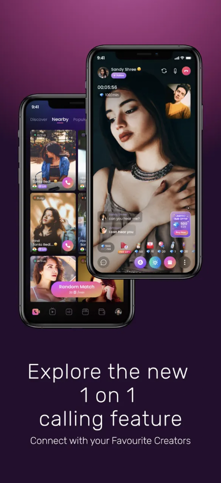
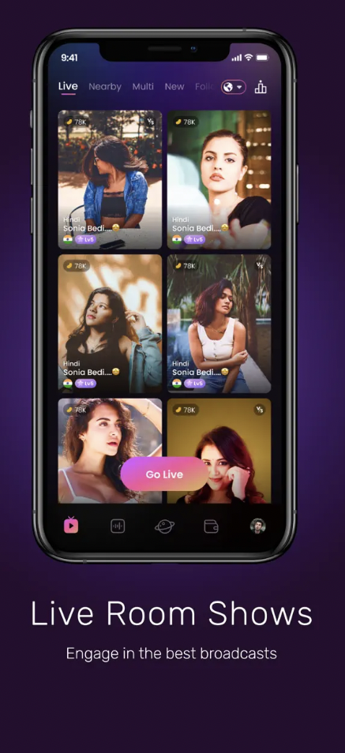
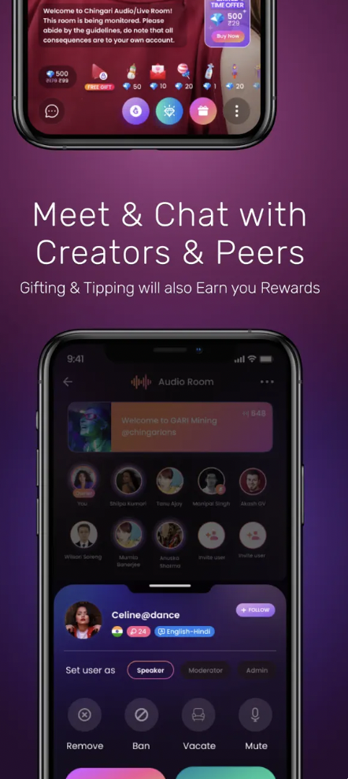

# 👋 Hi, I'm Rohit Pradhan

**`iOS Developer fueled by coffee`**

&nbsp;&nbsp;&nbsp;&nbsp;&nbsp;&nbsp;

 

---

### About
- 💻 I started learning iOS Development in 2013, after my academic
- I am a collaborative and design-minded iOS Mobile Developer with more than 8.5 years of experience in developing and maintaining high-performance and reusable native mobile applications that vary in scale, scope, and complexity.
-   I'm from India
- 🖌️ I'm a big SwiftUI fan and love learning new frameworks

 ### Skills
- UIKit
- SwiftUI
- Combine
- RxSwift
- Unit Testing
- MVVM, VIPER, MVP
- Core Data
- Firebase
- MapKit
- CoreBluetooth
- GraphQL

# Chingari   

Chingari is the fastest-growing on-chain social app, where you can create captivating videos, dance to your favorite tunes, and elevate your content with exciting AR filters. Chingari's features go beyond videos, with Chingari, you can also enjoy the unique features of private calls, allowing you to connect one-on-one with friends and loved ones.

I'm extremely proud to be part of the core team of the App. I have worked  Circles feature, which contains a feed showcasing text, images, and video posts.

&nbsp;&nbsp;&nbsp;&nbsp;&nbsp;&nbsp;&nbsp;&nbsp;&nbsp;&nbsp;

<!--
**rohitpradhan/rohitpradhan** is a ✨ _special_ ✨ repository because its `README.md` (this file) appears on your GitHub profile.

Here are some ideas to get you started:

- 🔭 I’m currently working on ...
- 🌱 I’m currently learning ...
- 👯 I’m looking to collaborate on ...
- 🤔 I’m looking for help with ...
- 💬 Ask me about ...
- 📫 How to reach me: ...
- 😄 Pronouns: ...
- ⚡ Fun fact: ...
-->
